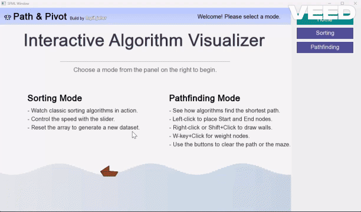
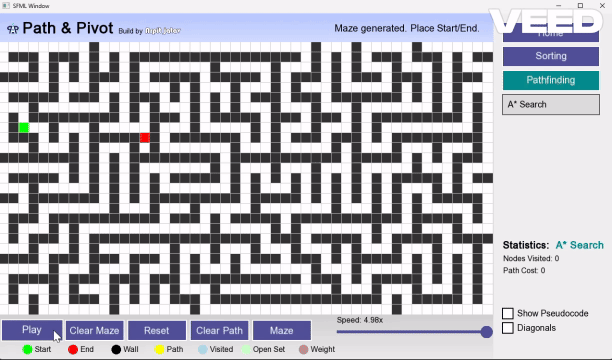

# Path & Pivot - An Interactive Algorithm Visualizer

Path & Pivot is an interactive algorithm visualizer designed to demonstrate the real-time execution and behavior of classic sorting and pathfinding algorithms.

The project was originally developed as a **C++/SFML desktop application** and has been extended with a **browser-based version** that allows users to interact with the visualizer directly without installing the desktop application.

> **Live Demo:** [Path & Pivot](https://arpitmurailya18.github.io/Path-Pivot/)

---

## Preview

### Sorting Mode Visualization



*A snapshot of Merge Sort in action.*

### Pathfinding Mode Visualization



*A* Search finding a path through a user-generated maze.

---

# Features

## Sorting Mode

The sorting visualizer provides step-by-step visualization of the following algorithms:

- Bubble Sort
- Selection Sort
- Insertion Sort
- Merge Sort
- Quick Sort

### Sorting Features

- Generate new arrays
- Adjustable visualization speed
- Start / Pause / Resume
- Reset
- Real-time comparisons
- Swap visualization
- Sorted-element visualization
- Comparison statistics
- Array access statistics
- Algorithm pseudocode
- Current pseudocode line highlighting

---

## Pathfinding Mode

The pathfinding visualizer provides interactive visualization of:

- Breadth-First Search (BFS)
- Depth-First Search (DFS)
- Dijkstra's Algorithm
- A* Search

### Pathfinding Features

- Generate random mazes
- Create custom walls
- Add weighted nodes
- Set custom start point
- Set custom end point
- Optional diagonal traversal
- Adjustable visualization speed
- Start / Pause / Resume
- Clear Visualization
- Reset
- Visited-node visualization
- Open-set visualization
- Final path visualization
- Visited-node statistics
- Path-cost statistics
- Algorithm pseudocode
- Current pseudocode line highlighting

---

# Interactive Visualization

The visualizer uses different colors to make algorithm execution easier to understand.

### Pathfinding Color Legend

| Color | Meaning |
|---|---|
| Green | Start / Final Path |
| Red | End |
| Gray | Wall |
| Purple | Visited Node |
| Orange | Open Set |
| Yellow | Weighted Node |

---

# Tools & Technologies

## Desktop Application

- **Language:** C++
- **Graphics Library:** SFML
- **Compiler:** g++ / MinGW
- **Build Environment:** Windows

## Web Application

- **HTML**
- **CSS**
- **JavaScript**
- **Deployment:** GitHub Pages

## Development Tools

- Git
- GitHub
- Visual Studio Code

---

# Project Structure

```text
Path-Pivot/
│
├── Algo Visualizer/
│   └── sfml work/
│       ├── include/
│       ├── src/
│       ├── assets/
│       └── ...
│
├── web/
│   ├── index.html
│   ├── style.css
│   ├── script.js
│   └── path-pivot-logo.png
│
└── README.md

Installation & Setup
Path & Pivot can be used in two ways:
1. Desktop Application (C++/SFML)
2. Web Application
1. Desktop Application
The desktop version is the original C++/SFML implementation.
Option A - Download the Pre-Built Application
This is the easiest way to run Path & Pivot on Windows.
Requirements
- Windows
- No compiler required
- No SFML installation required when using the pre-built release
Installation
1. Go to the Releases page.
2. Download the latest .zip release.
3. Extract the downloaded ZIP file.
4. Open the extracted folder.
5. Run: main.exe
